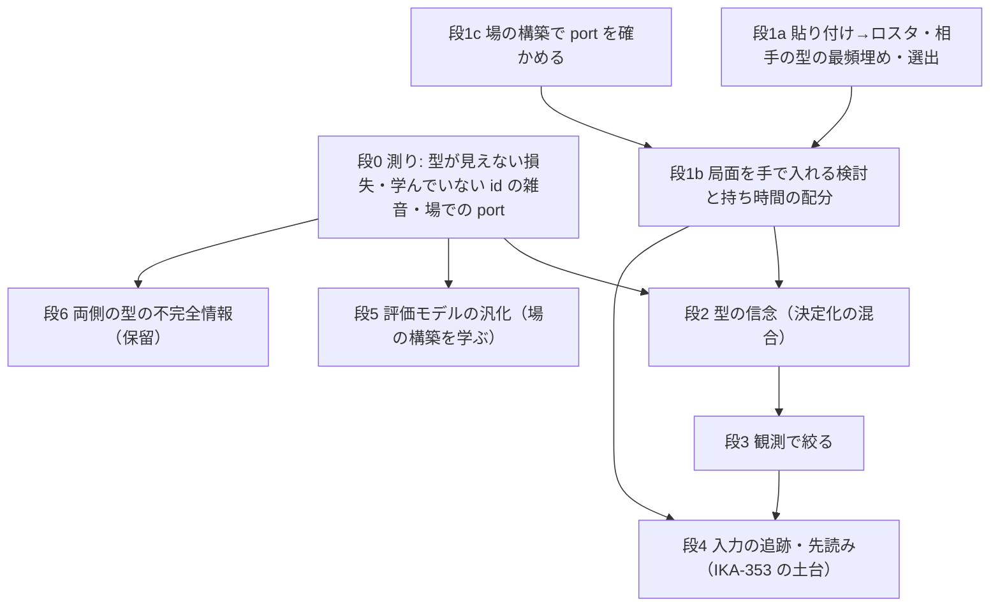

# IKA-404: ランクマで使えるようにする（計画） —— 最低限の形は「任意の構築の貼り付け＋相手の型は大会データの最頻の型で埋める＋局面を手で入れる検討＋持ち時間の配分」。型の信念・観測での絞り・入力の追跡・評価モデルの汎化はその後の段

2026-09-30。担当 IKA-404（worker）。master 20a03a6 から切った `ika-404-ranked-plan`（worktree `C:/tmp/ika404/wt`）。コードの変更なし（この記録だけ）。
調べるための小さなスクリプトと出力は `C:/tmp/ika404/`（コミットしない）: `coverage.py` → `coverage.json`（語彙と大会の場の重なり）、`embed_norms.py` → `embed_norms.json`（評価モデルの埋め込みの行の大きさ）、`set_spread.py` → `set_spread.json`（種族ごとの型の散らばり）、`handbook.txt`（公式の大会規則の PDF の文字起こし）。どれも 1 コアで 1 分未満、heavy.py は使っていない。
用語は用語集どおり（裏・裏の決定化・対戦評価・候補集合）。「型」は 1 体の技・持ち物・特性・性格・SP の組。「場」は大会の実エントリーの集まり（Baltimore の M-C のエントリー）。

## 0. 要点

* **任意の 6 体で打つ・読む口は、半分はもうある。** `tools/play_human.py` は `--human-team-file`・`--agent-team-file` でプール外のロスタのファイルを読み（`tools/play_human.py:295-296, 543-546`）、選出はその場で 2 つのシートから解く（`humanplay.solve_entry`、`src/pokeuraou/humanplay.py:2425`）。検討（`analysis.load_point`）も 2 つのシートを丸ごと持つ点のファイルを読む（`src/pokeuraou/analysis.py:291-345`）。Showdown の貼り付けの読み取りも `tools/fetch_pastes.py` の `parse_paste`・`normalise`・`build_team`（361・399・496 行）にある。**足りないのは「相手の型が分からない」ことと「局面を手で入れる口」**。
* **評価モデルは学んでいない種族・技を黙って雑音で読む。** 語彙は M-C の dump 全体（種族 392・技 515・持ち物 166・特性 316）で、Baltimore の場の id はすべて語彙にある（0 番＝不明に落ちる id は 0）。ただし学習の局で出た id はプールと M-B の Worlds を合わせても種族 95・技 214 だけで、残りの行は初期値の乱数のまま（行の大きさの中央値が、出た行と同じ 6.5 前後。§1.3）。**止まらず、落ちず、乱数の埋め込みで答える。** 場の 1 体ごとに見ると、種族・技・持ち物・特性がすべてプールに出ている体は 88.8%、6 体すべてそうな構築は 58.1%。
* **相手の型は種族だけからはかなり散る。** Baltimore で 10 体以上いる 60 種族では、最頻の型（特性・持ち物・性格・4 技）が体の 34.7%、上位 3 型で 56.2%、上位 8 型で 75.2%。持ち物だけなら最頻で 73.1%。**「最頻の型で埋める」は半分以上外れる**ので、最低限の形の次に型の信念（決定化の混合）が要る。
* **時間は公式に 選出 90 秒・1 ターン 45 秒・持ち時間 7 分・総合 20 分**（ポケモンHOME のお知らせ「レギュレーションM-C について」9/9 更新、大会規則 2026-09-01 版 4.3.1 も同じ数）。M-C の局は平均 9.0 ターン（90% 点 12）なので、持ち時間 7 分を守るには 1 ターンの読みは 15〜20 秒が上限の目安で、今の画面の既定（1 手 45 秒・選出 90 秒）はそのままでは入力の時間を入れると持ち時間を割る。
* **規約:** 大会規則 7.4.1 は、大会中に「進行中の対戦を模擬する第三者のソフト」を禁じている。ランクマ中の使用の可否は公式の文で確かめられていない（§4.3）。ユーザーに決めてもらう問い。

## 1. 調べ 1: プール外の構築

### 1.1 プール（`data/pool/regmc-matchupweb.json`）を前提にしている所

| 所 | 何を前提にしているか | 根拠の行 |
|---|---|---|
| 生成・対戦評価 | 両席をプールの 65 構築から引く（`pool.draw_pair`） | `src/pokeuraou/pool.py:1-27, 83` |
| 人と打つ道具 | 既定はプールから 2 構築。`--human-team-file`・`--agent-team-file` でロスタのファイル（プール外）も読める。ただし規則（regulation）はプールのファイルから取るので、プールのファイルは要る | `tools/play_human.py:295-296, 422-423, 543-555` |
| 選出 | 2 つのシートからその場で解く（葉の 1 回の見積もり 0.5〜0.8 秒、深い読みは既定 90 秒）。プールの選出の解（`selection-solved/`）は使わないので、プール外でも動く | `humanplay.solve_entry`（`humanplay.py:2425-2458`）、`PLAY_SELECTION_SECONDS = 90.0`（`humanplay.py:527`）、records/IKA-330.md:175 |
| 検討（記録から） | 記録の `pool.teams` の id をプールで引く。プールに無い構築の記録は「裏を全公開として読む」に落ちる | `analysis._pool_teams`（`analysis.py:171-196`） |
| 検討（点のファイル） | 2 つのシートを丸ごと持つので、プール外でも読める（`play_human --current-out` が書く） | `analysis.point_json`・`load_point`（`analysis.py:291-345`） |
| 評価モデル・Q の語彙 | 語彙は dump 全体で、プールではない。ただし学習の局はプールの 65 構築（温間の元の value-gen11L は M-B の Worlds の場） | `encode.build_vocabulary`（`encode.py:370-`）、GENERATIONS.md:1967・1984 |
| 相手の型の分布 | M-C の使用率ファイルは手元に無い（`data/priors/raw` は M-B の chaos 1760 だけ）。M-C の大会データは Baltimore の 1 大会（`data/standings/2027-baltimore.json.gz`、SP は無い） | GENERATIONS.md:1773、TODO.md:6723- |

### 1.2 任意の 6 体（Showdown のチーム文字列）で打つのに要るもの

1. **自分の構築:** 貼り付け → ロスタ。`fetch_pastes.parse_paste`・`normalise`（メガの表記を元の種族＋石に直す）・`build_team`（dump での検査）を、ファイル 1 つ・貼り付け 1 つで呼べる口にする（今は Match Up Web のシートの取り込み専用の駆動の中にある）。SP は貼り付けの `EVs:` 欄（Champions の書き出しでは SP）。ゲームの能力の画面から書き写した実数値があれば `teams.verify_shown_stats` で確かめられる。
2. **相手の構築:** ランクマでは種族だけ（§2）。型は事前分布から埋める（段 1 は最頻の型、段 2 で混合）。
3. **port の網羅:** port の正しさは主にプールと M-B の事前分布の上で見てきた（`tools/diff_turn.py` は M-B の事前分布からチームを引く。`diff_turn.py:1030`）。場の 148 種族・293 技の上で、拒否（`PortRefused`）と注記がどれだけ出るかは測っていない。
4. **評価モデル:** §1.3。

### 1.3 評価モデルが学んでいない種族・技が来たとき

* 符号化は `self.vocab.species.get(id, 0)` のように id を整数にする（`encode.py:654-658`）。**語彙は dump 全体なので、M-C で使える id はすべて自分の行を持ち、0（不明）には落ちない。** Baltimore の場の id で語彙に無いものは 0 個（`coverage.json` の `field_ids_not_in_vocab`）。
* 埋め込みは `nn.Embedding(..., padding_idx=0)`（`value.py:130-133`）、学習は AdamW（`value.py:658-659`、weight_decay 0.01）。学習の局に一度も出ない行には勾配が来ず、初期値の乱数が残る。**測った（`embed_norms.json`、value-mc1.pt。s1 も同じ傾向）:**

| 表 | 次元 | 学習の局に出た行（プール ∪ M-B Worlds） | 出ていない行 | 出た行の大きさの中央値 | 出ていない行の大きさの中央値 |
|---|---|---|---|---|---|
| 種族 | 48 | 95 | 297 | 6.45 | 6.57 |
| 技 | 32 | 214 | 301 | 5.42 | 5.34 |
| 持ち物 | 24 | 73 | 93 | 4.60 | 4.57 |
| 特性 | 24 | 77 | 239 | 4.69 | 4.60 |

  出ていない行は出た行と同じ大きさの乱数のベクトルで、「分からない」ではなく「何か別のもの」として読まれる。能力値（SP から計算した実数値）とタイプは別の特徴として入る（`encode.py:486-505`）ので、種族の強さの大まかな所は拾えるが、**技は埋め込みでしか入らない**ので、学んでいない技を持つ体の値は雑音になる。止まる・落ちることはない（黙って答える）。
  「学習の局に出た」はプールの 65 構築と M-B の Worlds の 394 構築の id の和で数えた近似（M-B の生成は事前分布から埋めた欄もある）。**値がどれだけ動くかは測っていない**（段 0 の測り）。
* **場とプールの重なり（`coverage.json`、Baltimore 1,077 構築・6,462 体）:** 1,077 は `standings.load_standings(..., M-C の規則)` が返した構築の数。IKA-79 の「M-C に完全適合 1,067」とは数え方が違う（差の 10 の中身は確かめていない）。

| 数え方 | プールだけ | プール ∪ Worlds |
|---|---|---|
| 種族・技・持ち物・特性のすべてが学習の局に出た体 | 88.8% | 93.6% |
| 6 体すべてがそうな構築 | 58.1% | 71.5% |
| 6 体の種族がすべてプールにある構築 | 80.5% | — |
| 出現で重みを付けた id の割合（種族 / 技 / 持ち物 / 特性） | 95.5 / 97.7 / 96.1 / 95.6% | 97.5 / 99.0 / 97.2 / 98.1% |

  プールに無い種族の上位（体の数）: セグレイブ（baxcalibur）17・サザンドラ（hydreigon）15・ファイアロー（talonflame）14・アブソル（absol）14・バサギリ（kleavor）12・ネギガナイト（sirfetchd）11。技: アクアブレイク（liquidation）32・アクロバット（acrobatics）24・つじぎり（nightslash）19。持ち物: `garchompitez` 64（プール ∪ Worlds にも無い）。名前は `configs/names/ja.json`。
* **Q（`data/models/q-mc0.pt`）** も同じ符号化器で読む（`qrank.QVocabularyError` は語彙の違いを見るだけ。`qrank.py:60`）。同じく学んでいない行は雑音。検討の幅 64（ほぼ全手）では候補集合の選び方への効きは小さいが、短い時間の手（幅 18〜36）では候補集合の質に響く。

## 2. 調べ 2: 相手の型が見えない

### 2.1 今の信念の前提

* 裏の信念（`hidden.completions`、`hidden.py:187-276`）は **「相手の 6 体の型は分かっていて、選出の 4 体と裏が見えない」** 前提。見えていない枠をシートの残りの体で組み合わせで埋め、重みは選出の均衡の周辺（`selection_book.BenchPrior`、`selection_book.py:668-`）。docstring の冒頭が「Champions shows open team sheets, so the opponent's *six* is public」（`hidden.py:3`）。
* 裏の決定化は「まだ場に出ていない体は状態を持たないので、シートから作り直してよい」（`hidden.py:22-30`）を使う。**型が見えないときは、場に出た体も型が分からないので、この「作り直し」を場の体にも広げる**（HP の %・状態・能力変化・揮発状態は残し、型だけ差し替える）。最大 HP は SP で変わるので、HP は表示の % の帯（`hpdisplay.band_bounds`、`hpdisplay.py:154`）から決定化ごとに引き直す。
* 自己対戦の探索は相手の SP と正確な HP も見ている（IKA-131、`belief.py:9-11`）。SP の粒子（`belief.py`）と観測（`observe.py` の 4 つの経路: 受けたダメージ・与えたダメージの % の帯・先に動いた・割合の削れ）は M-B の 1 ターン検討（`cli.py`）の道具で、M-C の本番の読みには入っていない。
* ベイズ型の解（`equilibrium.solve_bayesian`、`equilibrium.py:456-`）は「相手は自分の型を知り、こちらは知らない」形で、**型ごとに列の数が違ってよい**（行の数だけ揃えばよい。`equilibrium.py:486-488`）。相手の技が型で変わると相手の手の集合が変わるが、この形にそのまま乗る。選出の解（`selection.solve_selection`）も型の組（`SpreadClass`）ごとの行列を取る形で、今は 1 組（`label="sheet"`）で呼んでいる（`humanplay.py:2443-2446`）。

### 2.2 型の分布の出どころ

| 出どころ | 手元 | 技・持ち物・特性・性格 | SP | 場としての近さ |
|---|---|---|---|---|
| 大会データ（Reportworm、Baltimore 2026-09-19〜20） | あり（1,077 構築が M-C に通る） | あり（シートの丸写し、構築ごとの組が残る） | 無い（シートが伏せる） | 大会の場。ランクマとはずれる |
| 大会データ（Brisbane・Frankfurt 9/26 以降の M-C の大会） | 無い（`tools/fetch_standings.py 2027 <event>` で取れるはず。未確認） | あり | 無い | 同上 |
| プール（Match Up Web の 65 構築） | あり | あり | **あり（390 体）** | 大会上位の型に寄る |
| Smogon の chaos（M-C） | 無い。M-C は 9/9 開始なので 2026-09 の集計は 10 月初めの見込み（未確認） | あり（周辺分布のみ） | あり | Showdown のラダー |
| ゲーム内の「バトルデータ」 | 無い | 技・特性・持ち物・能力ポイントの使用率の順位（二次資料による。§4） | あり（順位） | **ランクマそのもの** |

* `standings.py` は「SP は大会に無いので使用率から性格で条件付けて引く」形（`standings.py:17-22`）を M-B で持っている。M-C では使用率が無いので、SP はプールの同じ種族（・性格）の SP から取るのが今ある唯一の実データ。
* **型の散らばり（`set_spread.json`、Baltimore、10 体以上の 60 種族・6,221 体）:**

| 型の数え方 | 種族あたりの異なる型の数（平均） | 最頻の型が占める割合 | 上位 3 | 上位 8 |
|---|---|---|---|---|
| 特性・持ち物・性格・4 技 | 25.4 | 34.7% | 56.2% | 75.2% |
| 性格を除く | 19.7 | 43.0% | 65.6% | 83.0% |
| 持ち物・4 技 | 19.0 | 43.8% | 66.7% | 83.5% |
| 4 技だけ | 13.8 | 51.8% | 77.7% | 91.4% |
| 持ち物だけ | 4.7 | 73.1% | 93.4% | 99.5% |

  種族で差が大きい: オオニューラ 504 体で 108 型・最頻 9.7%（持ち物がグラスシード 199・サイコシード 149・しろいハーブ 115）、ガオガエン 316 体で 80 型・最頻 18.4%。一方 `arcaninehisui` は 264 体で最頻 77.7%、ライチュウ 240 体で 70.8%。
* 型は構築の中で連動する（持ち物の重複禁止、同じ構築の定番の組）。場の構築は 6 体中 5 体を共有する塊が 60.4%（TODO.md の IKA-79 の節）なので、**1 体ずつ独立に引くより、構築（6 種族の組）で近い大会の構築を引く方が当たる**見込み（測っていない）。

### 2.3 決定化に混ぜる形

* **1 つの決定化 = 相手の 6 体の型の組（シート 1 枚）**。事前分布: 見せ合いの 6 種族に近い大会の構築（6 種族のうち一致する数で重み）を重みつきで集め、無い種族は種族ごとの周辺分布から。持ち物の重複禁止で消す。SP はプールから（無ければ段の問い §6）。
* **今の裏の決定化との掛け算:** 裏の決定化（最大 C(4,2)=6、平均 3 前後）× 型の決定化 K。裏の決定化は「まだ出ていない体は曲がりの中で同じ解決を共有する」（`beliefnode.py` の 84.3% の共有）を使えるが、**型の違いは場の体の技そのものを変えるので、セルの解決は型の決定化ごとに別になる**。費用はおおむね K 倍。重みの軽い決定化を落とす既存の仕組み（`hidden.drop_light`、`w
`・`m
`、IKA-283）を型にも使う。
* **選出:** `solve_selection` に型の組 K 個を `SpreadClass` として渡せば、葉の 1 回の見積もりはそのままベイズ型の選出になる（費用 K 倍、今 0.5〜0.8 秒）。深い読み（`selection_deep.solve_selection_deep` は `col.sets` 1 組を取る。`humanplay.py:2451-2454`）は K 組に広げる改修が要る。
* **こちらの型は相手に見えている前提のまま（片側）。** ランクマでは相手もこちらの型を知らないが、「こちらが公開」は価値の下界で安全側（IKA-38 の M5 の順序）。配分の見え方の代償は M-B で 0.5 点だった（TODO.md G33）。両側を買うかは段 0 の数で決める。

### 2.4 観測で絞る形

* **確かな観測は排除に使う:** 使った技（その技を持たない型を消す）、持ち物の発動（オボンのみ・いのちのたま・メガシンカの石・きあいのタスキ）、特性の表示（いかく等）、先に動いた（素早さの不等式、`observe.MovedFirst`）、受けたダメージ（こちらの HP は正確なので 16 の乱数との照合、`observe.DamageTaken`）、与えたダメージの % の帯（`observe.DamageDealt`）。
* **「使わなかった」では更新しない**（IKA-38 の M3 の罠: 技を出さないのは戦略の選択なので、素朴に更新すると「隠すだけで騙せる」模型になる）。
* 観測がすべての決定化を消したら止めて知らせる（入力の誤りか、事前分布に無い型）。`observe.py` の `SpreadBelief.reweight` と同じ扱い（`observe.py:27-30`）。事前分布に無い型に備えて、周辺分布からの「その他」の決定化を小さい重みで残すかは段 3 の問い。

### 2.5 IKA-38 の計画との関係

IKA-38（M-B 時代、9/19）の M0〜M5 はこの計画の段に対応する。M-C では前提が 2 つ変わった: 選出と裏の信念は M-C で作られた（hidden・beliefnode・BenchPrior）、そして SP の粒子（belief.py）は M-C の本番に入っていない。

| IKA-38 | この計画 |
|---|---|
| M0 `--hide-sets` で「シートが見えない損」を測る | 段 0（局面集で、最頻の型で埋めた読みの損失） |
| M1 粒子を配分からセットへ | 段 2（型の決定化） |
| M2 縮約をセットへ | 段 2 の費用の手当て（軽い決定化を落とす、同じ解決の共有） |
| M3 観測チャネル拡張（「出さなかった」で更新しない） | 段 3 |
| M4 SpreadClass → SetClass、選出キャッシュの鍵を 6 種族に | 段 2（選出の K 組）。キャッシュはランクマでは使わない（その場で解く） |
| M5 両側不完全情報 | 段 6（保留。段 0 の数次第） |

## 3. 調べ 3: 実戦の入力を助ける

### 3.1 今の検討の入力の形

* 検討（`tools/analyze.py`）が読むのは、記録（`--record`）の決定か、`play_human --current-out` の点のファイル（`--current`）だけ。局面を手で組む口は無い（`tools/analyze.py:1-20`）。点のファイルは局面の正規形（`position.py`）そのものと、2 つのシート・見せた体・先発を持つ（`analysis.py:291-320`）。
* 古い 1 ターン検討（`setup.py`・`cli.py`）は M-B 時代の道具で、各側ちょうど 4 体を要る（IKA-124。`setup.py:242-247`）。M-C の本番の読み（裏の信念・候補集合・深化）は通っていない。

### 3.2 手で入れる局面で足りないもの

| 情報 | ゲームで見えるか | 今の形の要求 | 埋め方 |
|---|---|---|---|
| 自分の 6 体の型・SP・実 HP | 見える | 要る | 貼り付け＋毎ターンの HP の数 |
| 相手の 6 種族 | 見せ合いで見える（タイプも表示、二次資料） | シート丸ごと | 種族を選ぶ → 型は §2 の決定化 |
| 相手の型（技・持ち物・特性・性格・SP） | 見えない（出たものだけ） | 要る | 決定化（段 1 は最頻、段 2 は混合）＋観測 |
| 相手の HP | % 表示（Showdown の champions の規則は切り捨て。`hpdisplay.py:1-30`。実機で % が数字で出るかはユーザーに確かめる） | 正確な HP | 決定化ごとに % の帯から |
| 状態異常・能力変化・天候・フィールド・壁・おいかぜ・トリックルーム | 見える（残りターンは数える） | 残りターンの数も要る（`Effect.duration`） | 前のターンの入力から自動で 1 減らし、変わった所だけ入れる |
| ねむりの残り・こんらん・まもるの連続・PP・技の縛り（こだわり・アンコール） | 一部しか見えない | 要る | 既定値（PP は満タンから観測した使用を引く、まもるの連続は前のターンの入力から）と、推定の注記 |
| 裏の体（出た体・倒れた体） | 見える | `shown`・`fainted` | 入力 |
| ターン数・メガシンカを使ったか | 見える | 要る | 入力 |

* 局面の正規形は Showdown の内部の状態に近く、揮発状態の数え（`Effect.counter` 等）まで持つ。手で全部入れるのは現実的でないので、**段 1 は「前のターンの局面を引き継ぎ、変わった所だけ入れる」フォーム**、段 4 で「両側の手を入れると port が解決の枝を出し、観測（HP の %・急所・状態）に合う枝を選んで局面を進める」追跡にする。追跡なら残りターン・PP・揮発状態は port が持つ。

### 3.3 IKA-353・IKA-124 との関係

* **IKA-124**（1 ターン検討ツールが相手の 4 体を要求する）: 要るものは同じ（相手はシート 6 体＋各体の状態、見えていない枠は決定化）。M-C の検討（`analysis`）はもう裏の決定化を持つので、IKA-124 の残りは「手で入れる局面の形」に吸収され、段 1 で閉じられる。`cli.py`・`setup.py` を直す必要はない（M-C の読みを通っていない）。
* **IKA-353**（キャプチャボードの映像から局面を読む）: 段 1・4 の入力の形（「観測」の JSON）を、映像から自動で埋める将来の段。入力の形を先に決めておけば、IKA-353 はその形を出す読み取り器になる。IKA-353 の本文も「読めない情報（相手の実 HP、持ち物、配分）は裏の推定・信念で埋める」と、この計画の段 2・3 を前提にしている。

## 4. 調べ 4: 持ち時間の規則

### 4.1 公式の数

| 項目 | 数 | 出典 |
|---|---|---|
| 選出（対戦に出すポケモンの選出時間） | 90 秒 | ポケモンHOME のお知らせ「レギュレーションM-C について（9月9日更新）」 https://news.pokemon-home.com/ja/page/816.html 。大会規則 4.3.1「Team Preview: 90 seconds」 |
| 1 ターンあたりの選択時間 | 45 秒 | 同上。大会規則「Move time limit: 45 seconds」 |
| 持ち時間 | 最大 7 分 | 同上。大会規則「Player time ("Your Time") limit: 7 minutes」 |
| 総合時間 | 最大 20 分 | 同上。大会規則「Game time: 20 minutes」 |
| 期間 | M-C は 2026-09-09 〜 12-02 10:59。ランクバトル シーズン M-6 は 9/9 〜 10/7 10:59 で M-C を使う | https://news.pokemon-home.com/ja/page/816.html 、 https://news.pokemon-home.com/ja/page/822.html （M-6 のページは時間の詳細を「ゲーム内メニューの『詳しいルール』」に回している） |

大会規則: Play! Pokémon Video Game Championships Tournament Handbook（Last revision: September 1, 2026） https://www.pokemon.com/static-assets/content-assets/cms2/pdf/play-pokemon/rules/play-pokemon-vgc-tournament-handbook-en.pdf 、4.3.1 Game Time Limits。
816 のページはシングルとダブルで時間を分けて書いていない。「ランクバトルに適用」とも「大会に適用」とも書いていない（M-6 のページが M-C を使うと書いているので、ランクマの数と読んだ）。

### 4.2 時間切れの扱い（二次資料。公式の文では確かめていない）

* 1 ターンの時間切れ: 「バトルに出ているポケモンの技一覧の一番上にある技が次の行動として自動的に選択されます」（ゲームエイト https://game8.jp/pokemon-champions/764029 ）。
* 持ち時間切れ: その側の負け（同上、Game8 英語版 https://game8.co/games/Pokemon-Champions/archives/596247 ）。
* 総合時間切れ: 引き分け、ランク変動なし（Game8 英語版）。

### 4.3 見せ合いの情報と規約（公式では確かめられなかった）

* **ランクマの見せ合いで相手の何が見えるか:** 公式の文は見つからなかった。大会はオープンチームリスト（大会規則 2.4「All Pokémon information provided on the team list will be made available to the opponent except for the Pokémon's stats」）。Victory Road の規則のまとめは「In TPCi events, players will compete with open team lists」で、ランクマには触れていない（ https://victoryroad.pro/champions-regulations/ ）。見せ合い画面に相手のタイプが出るという二次資料がある（ポケモン徹底攻略の SV との違いのページ、検索の抜粋のみ）。IKA-38 の前提（種族だけ）と合うが、**ユーザーに実機で確かめてもらう**。
* **相手の HP が % の数字で出るか:** 確かめられなかった。Showdown の champions の実装は % の切り捨てを配っている（`hpdisplay.py:5-12`）。実機の表示はユーザーに確かめてもらう。
* **ゲーム内の「バトルデータ」:** ランクバトルの使用率と、技・特性・持ち物・能力ポイントの使用率の順位が見られるという二次資料（ゲームエイト https://game8.jp/pokemon-champions/779317 、検索の抜粋）。ランクマの相手の型の事前分布としては大会データより近いが、手元に取り込む手段（手で書き写す・第三者のサイト）は未定。
* **規約:** 大会規則 7.4.1「Competitors in VGC tournaments may not use any third-party software or modifications during tournament play. This includes using third-party software to simulate matches in progress」。ランクマ（大会ではない）に同じ禁止があるかは、ゲームの利用規約を確かめていない。IKA-353 の本文も「公式のランクマッチや大会の最中に AI の助言を受けるのは規約違反になりうる」と書いている。

### 4.4 今の画面の予算と合わせる形

* M-C の局の長さ: `data/selfplay-mc1/games-worker0.jsonl` の 865 局で平均 9.0 ターン、中央 9、90% 点 12、最長 52（手番の決定は平均 8.0）。
* 持ち時間 7 分 = 420 秒は、人が考えて入力する時間の合計。ツールを使うと 1 ターンに「局面を入れる（段 1 で 15〜20 秒の見込み、未測定）＋ツールの読み＋ゲームに手を入れる（5 秒）」がかかる。12 ターンで 420 秒に収めるには、1 ターンの読みは約 10〜15 秒。**45 秒の上限まで読むと 5〜6 ターンで持ち時間が尽きる。**
* 形: 1 ターンの読みの予算 = min(45 − 入力の余裕, (持ち時間の残り − 予備) / 見込みの残りターン数)。持ち時間の残りは、ツールが自分の時計で数える（入力の開始から手を出すまで）か、画面の表示を人が入れる。見込みの残りターン数は、局面の値と残りの体数から（最初は固定の表で）。
* 相手のターンの演出の間（持ち時間に数えない）に、ツールは次の局面の読みを先に始められない（局面の入力がまだ）。段 4 の追跡なら、両側の手が決まった時点で解決の枝の上位を先読みできる（`humanplay` の `PLAY_PONDER_SECONDS` と同じ考え）。
* 選出: 90 秒の中に「相手の 6 種族を入れる（20〜30 秒の見込み）＋読み＋ゲームで 4 体を選ぶ（10 秒）」。読みは 40〜50 秒が上限。今の深い選出の読みは 90 秒（`humanplay.py:527`）なので、ランクマの形では 45 秒前後に縮め、型の決定化 K 組のときの費用も合わせて決める。選出の時間が持ち時間に数えられるかは未確認（ユーザーに確かめる）。

## 5. 計画（段）

一番安く「ランクマで最低限使える」形になる段 1 を先頭に置き、その損失を段 0 で測ってから段 2 以降を買う。

| 段 | 何をするか | 依存 | 費用（担当 / 機械） | 確かめ方（正の対照・対照） | 未決の問い |
|---|---|---|---|---|---|
| **0 測り** | (a) 局面集（IKA-394 の hidden40・開いた 24）で、相手の型を最頻の型（Baltimore から、その局の構築の選手を除いて作る）に替えた読みの、真の局面の基準での損失を、真の型で読んだ損失と比べる（こちらの型は同じなので、基準のゲームで混合の損失を採点する `tools/position_set.py` の形がそのまま使える。候補集合が基準の外の手を足したら、その質量は `position_set` の今の扱いどおり外して数える）。(b) 学んでいない id の雑音: プールの局の局面で、体の技 1 つ（または種族の行）を学んでいない id の行に替えたときの値の動きの分布を、学んだ別の id に替えたときと比べる。(c) Baltimore の構築どうしで `diff_turn` 相当（Showdown 対 port）と拒否・注記の数え。 | なし | 担当 0.5〜1 日。機械 (a) 40 局面 × 2 条件 × 15 s × 16 コア ≈ 20〜30 分の専有（基準は IKA-394 のものを使う）、(b)(c) 1 コア数分〜数十分 | (a) 正の対照: 型を替えた局面で相手の候補集合が実際に変わった数を数える（変わらなければ 0 損失は空）。対照: 型を真の型に「替えた」読みが元の読みとビット一致（ノード時間）。(b) 対照: 同じ id に替えると値が不変。(c) 正の対照: 既知の穴（IKA-213 の表の技）を差し込んだ標本で乖離が出る | 最頻の型の損失がどの大きさなら段 2 を急ぐか（目安: 開いた 24 局面の読みの損失 0.009〜0.016（records/IKA-364.md:18）と同じ桁か） |
| **1a 構築と選出** | 貼り付け 1 つ → ロスタ（`fetch_pastes` の読み取りを口にする）。相手は 6 種族の入力から、Baltimore の近い構築・種族の周辺分布で最頻の型を埋め、SP はプールの同じ種族（・性格）から。埋めた型と出どころを必ず表示し、人が上書きできる。選出は今の `solve_entry` で（深い読みは 45 秒前後）。 | なし | 担当 1 日 / 機械ほぼ無し | 正の対照: プールの 65 構築の貼り付け（`data/pool/regmc-matchupweb/` にキャッシュ済み）がプールの JSON と同じロスタになる。相手の種族が Baltimore に無いとき・SP の出どころが無いときに止まって知らせる。対照: 相手の型を真の型で与えたときの選出が今の `solve_entry` とビット一致 | SP の出どころが無い種族をどうするか（止める・「仮の配分」と明示して置く）。事前分布を大会の構築単位で引くか、種族ごとの周辺か |
| **1b 手で入れる検討と持ち時間** | 検討の画面（IKA-332・337 の画面）に、点のファイルを作るフォームを足す: 前のターンの局面を引き継ぎ、HP（自分は数、相手は %）・状態・能力変化・場の残りターン・出た体・倒れた体・メガを入れる。相手の型は 1a の埋め方、HP は % の帯の中央。読みの予算は §4.4 の式（持ち時間の残りを数える）。 | 1a（1c と並べてよい） | 担当 2〜3 日（画面はデザイン担当と組む） / 機械ほぼ無し | 正の対照: 記録の決定（開いた局面・裏ありの局面）をフォームの入力の形に落とし、作り直した点のファイルで読んだ答えが、記録から読んだ答えと同じ（ノード時間・`--max-steps` でビット一致）。入力の手間を実際の 1 局で秒で測る | フォームか文字の入力か。1 ターンの入力に何秒まで許せるか。読みの既定の秒 |
| **1c 場で port を確かめる** | `diff_turn` に大会データの構築を引く口を足し、Baltimore の構築で乖離・拒否・注記を数え、上位の穴を別課題にする | なし | 担当 0.5 日 / 機械 1 コア 30 分程度（heavy.py） | 正の対照: 既知の穴の技を持つ構築で乖離が出る | — |
| **2 型の信念** | 相手の 6 体の型の組を K 個の決定化にし、裏の決定化と掛けてベイズ型で解く（`solve_bayesian` は型ごとに列が違ってよい）。軽い決定化を落とす（`drop_light` と同じ形）。場の体も型を差し替える（HP は帯から引き直す）。選出は K 組の `SpreadClass`、深い選出の読みを K 組に広げる。画面に相手の型の候補と重み（IKA-332 の計画の 2）。 | 1b・0 | 担当 3〜5 日 / 機械: 局面集で K = 1, 2, 4, 8 を同じ秒で比べる 1〜2 時間の専有 | 正の対照: K = 1 で真の型を与えると今の読みとビット一致（`test_nothing_hidden_is_the_old_search_exactly` と同じ形）。型で技が違う局面で相手の列の集合が型ごとに違うこと。強さ: 局面集の損失を同じ秒で最頻の型（段 1）と比べる | K と秒の配分（K を増やすと読みが浅くなる）。構築単位の事前分布の作り方 |
| **3 観測で絞る** | 使った技・持ち物の発動・特性の表示・先に動いた・受けたダメージ（こちらの正確な HP との照合）・与えたダメージの % の帯で、決定化を消す・重み直す。「使わなかった」では更新しない。全部消えたら止めて知らせる。 | 2 | 担当 2〜3 日 / 機械ほぼ無し | 正の対照: Showdown のオラクルで作った観測（乱数を固定したダメージ）で、真の型が残り、消えるべき型が消える。対照: 観測なしで事前分布と同じ重み | 事前分布に無い型への備え（周辺分布の「その他」を残すか） |
| **4 入力の追跡と先読み** | 両側の手を入れると port が解決の枝を出し、観測（HP の %・急所・状態・倒れ）に合う枝を選んで局面を進める（残りターン・PP・揮発状態は port が持つ）。手が決まった所で上位の枝を先読みする。入力の形を IKA-353 の読み取り器の出力と同じにする。 | 1b・3 | 担当 3〜5 日 / 機械ほぼ無し | 正の対照: 記録の局を「手と観測だけ」で入れ直し、全ターンで記録の局面と一致する。観測に合う枝が無いときに止まる | 観測に合う枝が複数あるとき（乱数の幅が % の帯に収まる）の扱い |
| **5 評価モデルの汎化** | 学んでいない id への手当て（学んだ行の平均や 0 に置く、似た id の行を借りる）と、生成のプールを場に広げる（Baltimore 以降の構築、SP は事前分布から）。 | 0 の (b) | 手当ては担当 1 日。プールを広げるのは世代の決め（生成と学習で数日の機械） | 場の構築どうしの局（保留）での log loss、場の構築での対戦評価（SPRT） | 生成のプールを変えるか（本番の世代の流れに関わる。調整役とユーザーの決め） |
| **6 両側の型の不完全情報** | 相手もこちらの型を知らない形。 | 0 の数次第 | 大（IKA-38 の見積りで 40 時間級） | — | 買うか（M-B の配分では 0.5 点だった） |

**「ランクマで最低限使える」形は段 1a＋1b（＋1c の確かめ）。** 型は最頻の型で埋めた 1 つの決定化なので外れることが多い（§2.2 で 65% の体は最頻の型でない）。その損失を段 0 で数にし、段 2 を買う理由にする。段 0 は段 1 と並べてよい（コードを共有しない。(a) の型の差し替えはスクリプトで足りる）。

**強さへの影響の測り方（まとめ）:**

* 型が見えない損失: 段 0 (a)（局面集、最頻の型 対 真の型、同じ秒）→ 段 2 で K 個の混合 対 最頻の型（同じ秒）。局面集はプールの局なので、相手の型は大会上位の定番に寄り、ランクマより最頻が当たりやすい。**ランクマでの損失の下限**として読む。
* 学んでいない id の損: 段 0 (b)（値の動き）→ 段 5（場の構築での対戦評価）。
* 持ち時間: 局面集で 10・15・20・30 秒の損失の曲線（IKA-364・367 の形）を型の決定化ありで取り、§4.4 の配分の既定を決める。

## 6. ユーザーに聞くべき未決の問い

1. **規約:** ランクマの対戦中に使うか、対戦後の検討（と練習の対戦）に限るか。大会規則 7.4.1 は大会中の「進行中の対戦を模擬する第三者のソフト」を禁じている。ランクマの規約は確かめられていない。
2. **実機の表示:** ランクマの見せ合いで相手の何が見えるか（種族とタイプだけか）。対戦中の相手の HP は % の数字で出るか（バーだけか）。選出の 90 秒は持ち時間 7 分に数えられるか。
3. **相手の型の事前分布の出どころ:** 大会データ（Baltimore、以降の M-C の大会を取り足す）か、ゲーム内の「バトルデータ」（ランクマそのもの。取り込み方は手で書き写すか第三者のサイトか）か、Smogon の M-C の集計（10 月初めの見込み）か。
4. **SP の出どころが無い種族:** 止めるか、「仮の配分」と明示して置くか（今の規則は「型をこしらえない」。`teams.py:14-18`）。
5. **入力:** 画面のフォームで 1 ターンに何秒までなら入れてよいか。最初はフォーム（段 1b）で、追跡（段 4）は後でよいか。
6. **読みの既定の秒:** 1 ターン 10〜15 秒・選出 45 秒前後（持ち時間 7 分に収める）でよいか。
7. **評価モデルの汎化（段 5）:** 生成のプールを場の構築に広げるか（世代の流れに関わる）。

## 7. 確かめていないこと

* 学んでいない id の行で値がどれだけ動くか（行の大きさを見ただけ）。
* 場の構築での port の乖離・拒否。
* Brisbane・Frankfurt など 9/26 以降の M-C の大会データが Reportworm にあるか。Smogon の M-C の集計の有無。
* ランクマの見せ合いの情報・HP の表示・時間切れの扱い・規約（§4.2・4.3。二次資料か未確認）。
* 入力にかかる秒（見込みの数だけ）。
